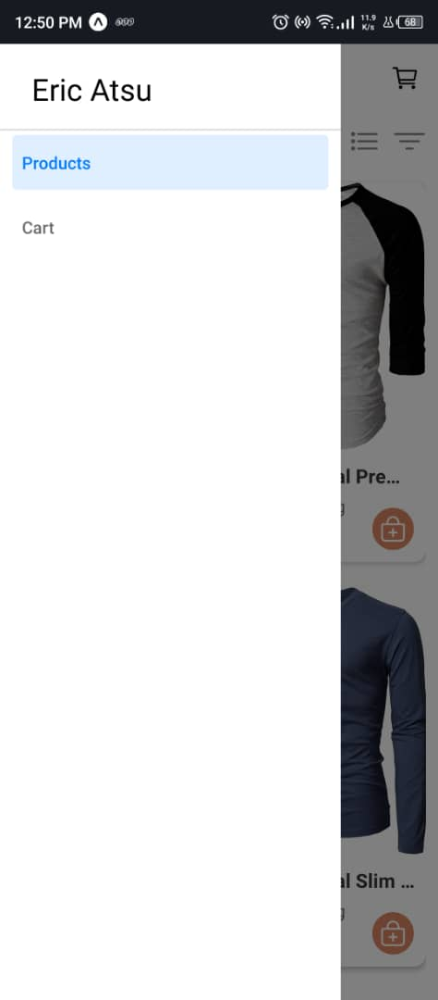

# Nana-K-Yentumey-rn-assignment7-11339613

## Overview
This React Native app is an e-commerce platform built with Expo. It features a product listing, product details, and a shopping cart, all navigable through a drawer navigation system.

## Design Choices

### Navigation
We implemented a combination of drawer and stack navigation using React Navigation. This choice provides:

1. Easy access to main sections (Products and Cart) via the drawer.
2. Smooth navigation between related screens (e.g., product list to product details) using stack navigation.
3. A consistent UI with a custom header image and cart icon across all screens.

### UI Components
- Custom Header: Replaces text titles with an image for brand consistency.
- CartIcon: A dynamic icon showing the current number of items in the cart.
- CustomDrawerContent: Personalizes the drawer with a user name at the top.

### State Management
We use React's Context API for managing the shopping cart state. This allows for:
- Global access to cart data across all components.
- Centralized management of cart operations (add, remove, update items).

## Data Storage Implementation

### Cart Data
Cart data is managed using React's Context API and stored in the device's local storage:

1. CartContext.js:
   - Provides a context for cart operations.
   - Implements functions for adding, removing, and updating cart items.
   - Uses AsyncStorage to persist cart data between app sessions.

```jsx
import AsyncStorage from '@react-native-async-storage/async-storage';

export const CartProvider = ({ children }) => {
  const [cart, setCart] = useState([]);

  useEffect(() => {
    // Load cart data from AsyncStorage on app start
    loadCart();
  }, []);

  const loadCart = async () => {
    try {
      const storedCart = await AsyncStorage.getItem('cart');
      if (storedCart) {
        setCart(JSON.parse(storedCart));
      }
    } catch (error) {
      console.error('Error loading cart:', error);
    }
  };

  const saveCart = async (newCart) => {
    try {
      await AsyncStorage.setItem('cart', JSON.stringify(newCart));
    } catch (error) {
      console.error('Error saving cart:', error);
    }
  };

  const addToCart = (item) => {
    const newCart = [...cart, item];
    setCart(newCart);
    saveCart(newCart);
  };

  // ... other cart operations

  return (
    <CartContext.Provider value={{ cart, addToCart, /* other functions */ }}>
      {children}
    </CartContext.Provider>
  );
};

```

## Setup and Running the App

1. Clone the repository using:
   
   `git clone https://github.com/Nana-K-Yentumey/rn-assignment7-11339613.git`

2. Run `npm install` to install dependencies

3. Run `npx expo start` to start the Expo development server
   
4. Use the Expo Go app on your device or an emulator to run the app

## Screenshots:

.jpg)




